## XCTestの歴史
XcodeはUnit Testをサポートするため`XCTest`というFrameworkを提供してる。
余計なことを言うが、iPhoneに存在するiOS Frameworkではないので、Test BuildとTest時に使われるのFrameworkだ。

* XCTest

  Xcode5、6までのbackground method用のFramework

* UIAutomation

  Xcodeの拡張developer tool、javascriptを使う。Accessibility Frameworkと一緒に使って画面のelementを検索できる。

* XCUITest

  Xcode7からXCTestとUIAutomationを統合したFrameworkが、Accessibility使わなくてもできる。Objective-CとSwiftで書ける。

XCUITestがXcodeに統合されているから_File->New UI Test Case_で簡単に作れるし、且つ動作の録画機能もある。
滅多にTestソース書かず、一回だけ手動でやればscriptが自動生成されるので、世の中ほとんどのアプリが十分楽にtestできると思う。

私の場合はちょっと複雑な状況だった。
testの途中にtest target appの画面から何度も外に出ることがあって、手動で戻させないとtestが続かないから、完全な自動化と言えない。
この問題を解決するため、Facebookの[WebDriverAgent](https://github.com/facebook/WebDriverAgent)を借りることとなった。

---
## Xcode XCTestの使い方

### 準備
Xcode projectを新規作成する時、案内画面の下に`Include Unit Tests`と`Include UI Tests`のcheckboxがあります。checkを入れると、Testに必要なBundle Build Targetが自動生成される。
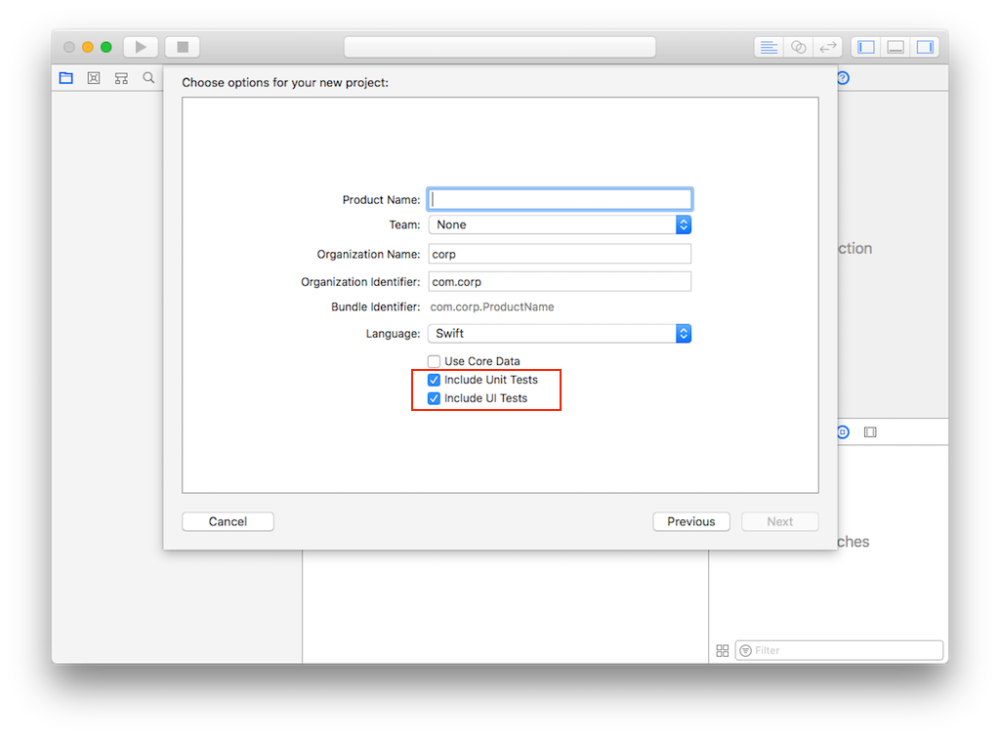

checkを忘れた場合、改めてNew Targetで`iOS Unit Testing Bundle`或いは`iOS UI Testing Bundle`を追加しなければ相応のTest Buildができない、testも当然できない。
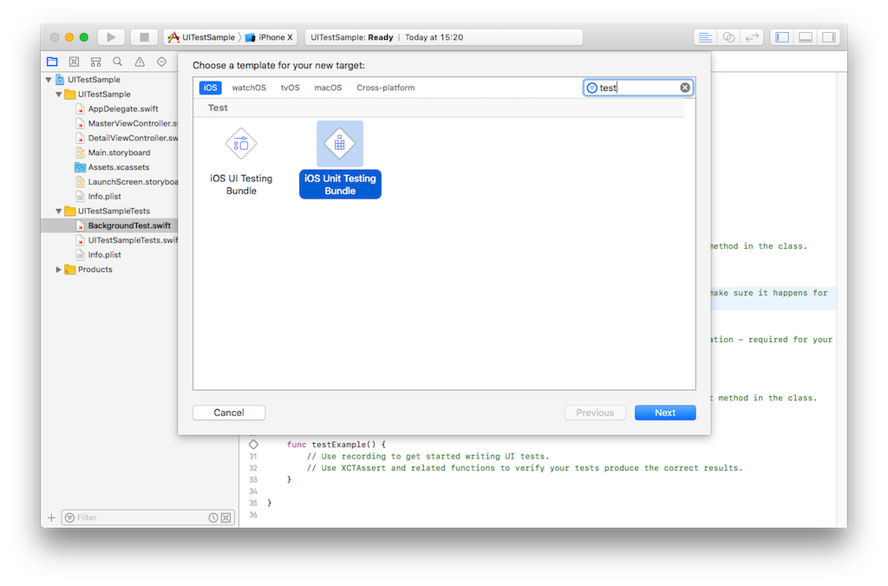

### Unit Test Case
Background methodをUnit Testだけに適応
* Targetsに`iOS Unit Testing Bundle`の存在を確認。`Host Application`の設定が特徴。
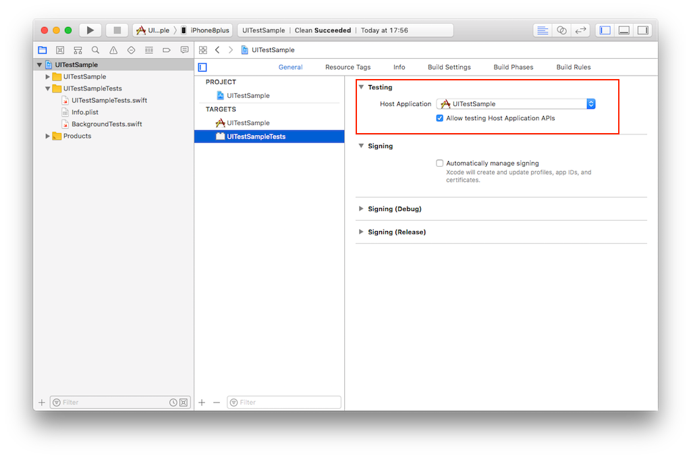
* Xcodeの`New File` 案内画面から `Unit Test Case Class`を選択し、test source の file名と言語を決める。
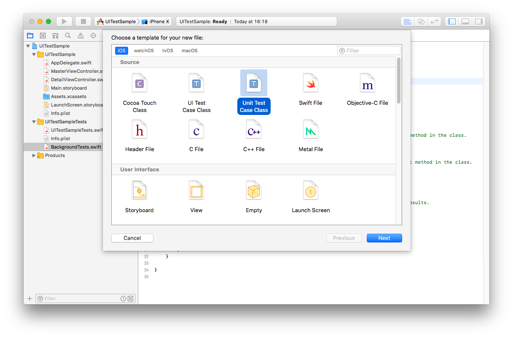
* Test Bundle Targetにcompile対象に含まれてるかを確認
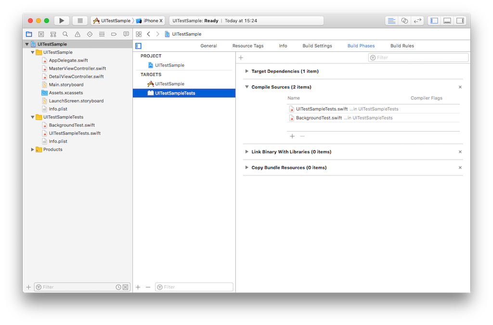
* 嬉しいことに見慣れた`setup`、`tearDown` methodがtemplateから自動生成されてる。初期化とリセット処理を自分で入れろう。
* testしたい内容を`test`の文字で始まるmethodを追加したら完成です。
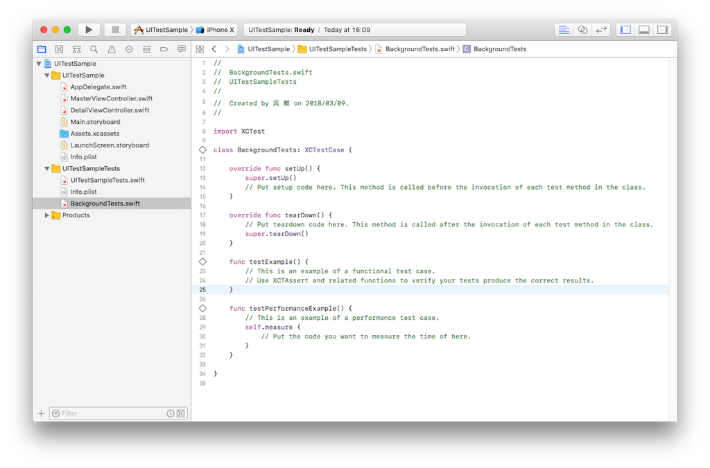
* Unit Test Caseを実行するにはsimulatorでなければならない。
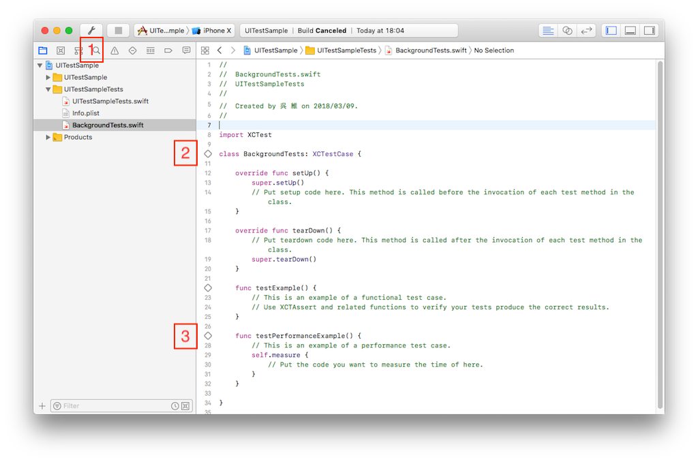
    0. 一括全部実行[`cmd + u`]
    0. file単位で実行
    0. method単位で実行

__Tips__
> 一括実行の時、実行順番はmethod名で決める。順番を指定するworkaroundは`test_01_firstMethod`、`test_02_secondMethod`のようなフォーマットでmethod名にする

### UI Test Case
UI操作と画面のtestしたい
* Targetsに`iOS Unit Testing Bundle`の存在を確認。`Target Application`の設定が特徴。
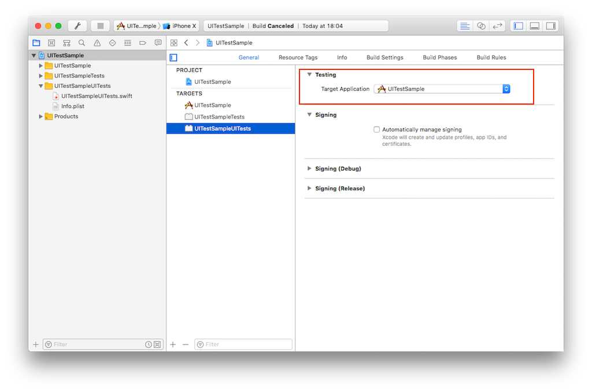
* 今度Xcodeの`New File` 案内画面から 別の`UI Test Case Class`を選択し、file名を決める。
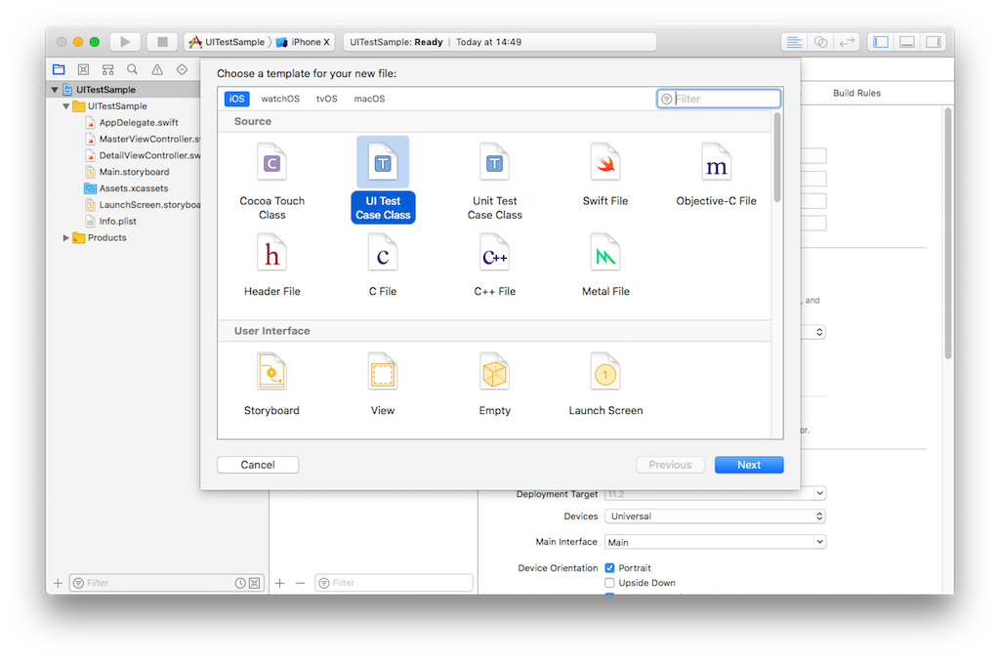
* Unit Testのtemplateとほぼ一緒、違うのは新しいAPI`XCUIApplication()`。 `XCUIApplication()`はappのinstanceを返すmethod、appはtest target appのこと、画面の各elementのroot elementでもある。
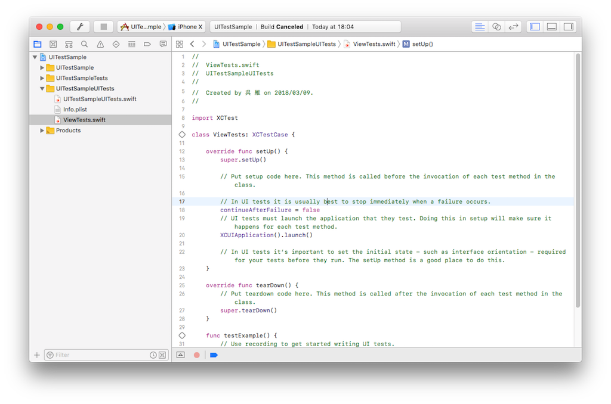
* `test`の文字で始まる空のmethodを追加し、括弧の中にクリックして編集のcursorをmethod内にすれば、編集windowの下にdisable状態だった赤いbuttonがenableに変わる。それは録画buttonだ。
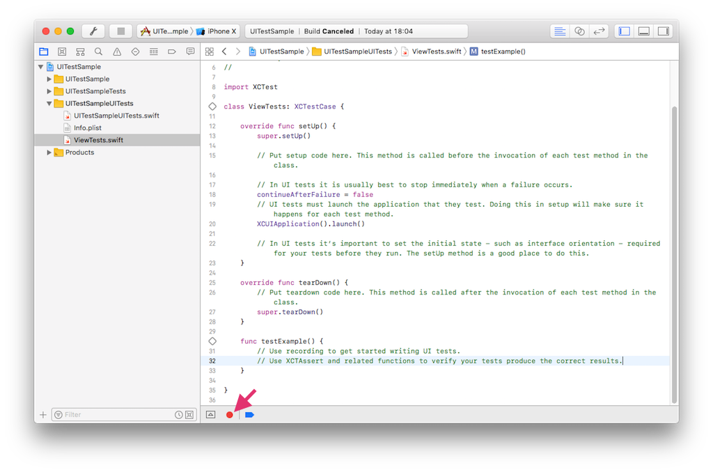
* 録画buttonをクリックしてたら、test target appが起動され、test手順を踏まえてappを操作すれば、methodの中にtestのscriptが自動生成される。
* 再度録画buttonをクリックすると録画終了となる。test結果の比較処理を追加すればtest methodも追加完成する。
* それからtest実行すると、xxTest-Runner見たいなアプリがインストールし、起動され、その後target appに切り替す。

---

## WebDriverAgent (WDA)
Web test界には[Selenium](https://www.seleniumhq.org/)があるように、App test界は[Appium](http://appium.io/)がある。
Seleniumと同じjavascriptでtest scriptが作れる。
悪くないが、Appiumはtestのcross platform方案だ。
私は暫くiOSだけが欲しい。

Appiumを深く調べれば、本当にAppium iOS testを支えっているのは[WebDriverAgent](https://github.com/facebook/WebDriverAgent)だと見つけた。
名前の文字通り、WebからiOS端末を駆動できるagentです。
素晴らしいが、恐しい！iPhoneがハッキングされてるじゃないか？初めてiPhoneが勝手に動く動画を見た時私もそう思った。

WDAのオーブンソースを読むと、大きい三つの部分に分けられる。
1. HTTP Server

  Cartfileから、外部ライブラリ`github "marekcirkos/RoutingHTTPServer"`が使われてることが分かる。

2. endpoint API

  URLを解析してnative APIに振り分ける

3. XCTest native API

  コアな部分、test target Appを人形のように操る

### Architecture
remote controlの流れ

* remote PCからWDAのRunner AppにHTTP requestを送る
* WDAのRunner AppがXCTestのnative APIを呼ぶ
* XCTest APIがtarget Appを操作


### Web Base API
WDAのRunner Appが一つのHTTP Server Appだと思えばいい。
Server URLは`http://x.x.x.x:8100`のようになる。
後はrequestを送ってtest target Appの画面を検査したり操作したりするだけ。

__一部API__：

|endpoint|説明|
|:---|:---|
|`session`|接続情報|
|`inspector`|端末画面詳細|
|`source`|画面elements TreeのJSON|
|`session/:sessionId/elements`|element検索|
|`element/:elementId/elements`|sub-element検索|
|`element/:elementId/click`|elementをクリック|
|...|...|

### Browserからremote control
Browserでinspectorのendpointを送信すると、inspector画面が表示される。また端末のスクリーンコピーからelement treeを参照し、elementをクリックしたりできる。
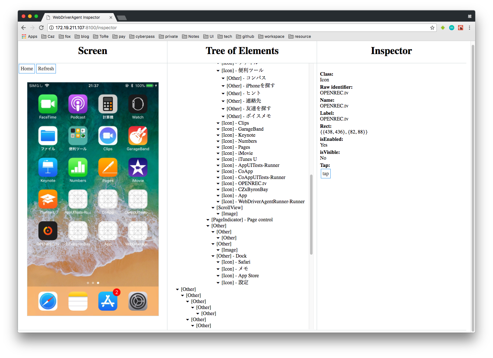

__Tips__
> WIFIは便利ですけど、WIFIない時にUSB経由したい場合以下のツールが使えそうになる。
* [mobiledevice](https://github.com/imkira/mobiledevice)
* [usbmuxd](https://github.com/libimobiledevice/usbmuxd)

---

## WDAの違う使い方
cross platformではないし、remote操作も要らないから必ずWDAのHTTP Serverを使うことがない。WDAはXCTestのPrivate APIを整理して公開しているから、標準にない機能が使えるのがもう一つのメリットだ。

WDAのFrameworkをtest build targetに追加して、XCTest APIと一緒にObjective-C或いはSwiftでtest caseを書くと、private APIと便利な録画機能両方のメリットが受けられる。

いくつのAPIを覚えよう。

### Public API
XCTest Header filesに公開されているAPI。基本な検索と操作をサポートしている。

例:
0. `let app = XCUIApplication()`

  test target appのinstanceを返す。

0. `app.launch()`
  appを起動させる。

0. `let safari = XCUIApplication.init(bundleIdentifier: "com.apple.mobilesafari")`

  SafariのbundleIdentifierを指定してをSafariのinstanceを返す。

0. `app.tables.staticTexts["normal event"].tap()`

  listから"normal event"の行をtapする。

0. `app.sheets.buttons["IDをリセット"].tap()`

  "IDをリセット"のbuttonをtapする。

0. `app.terminate()`
  appを停止させる。

> [API reference](https://developer.apple.com/documentation/xctest/user_interface_tests?language=objc)

### Private API
WDAが公開されたXCTestのHeader fileに満足できず、binary libraryから使われてるobjectとmethod symbolをdumpして、使えそうな隠しAPIを洗い出した。更にそのPrivate APIを利用して便利なAPIを増やした。

0. `FBApplication.fb_active`

  現在activeしているappのinstanceを返す。

0. `fb_waitUntilSnapshotIsStable`

  画面表示が安定しているかの判定。


### life show

## 残タスク
まだまだ完全な自動操作ではない。
コマンドラインからxcodebuildを実行すればappやtest appが自動でinstallまた実行されるが、appを削除するために別のツールが必要となる。

* [ios-deploy](https://github.com/phonegap/ios-deploy)

  ```
  # device ID listを出力
  ios-deploy -c

  # bundleIdentifier指定app削除
  ios-deploy -9 -1 <bundleIdentifier>
  ```

* [libimobiledevice](https://github.com/libimobiledevice/libimobiledevice)

## iOS beta test
iOS betaを使いためよく`xcode-select`を勧められたが、使い終わった後もう一回`xcode-select`で戻らなければならない、非常に面倒臭い。

xcode-selectのmanを見ると実際は環境変数DEVELOPER_DIRを変更したにすぎないため、
terminalで手動でDEVELOPER_DIRを変更することもできる。
`export DEVELOPER_DIR=/Applications/Xcode-beta.app/Contents/Developer`
そうするとxcodeバージョンの切り替えはterminalのsession以外に影響持たない。terminalを閉じればいい、設定を戻る必要がない。

## Swift Script
shell scriptで複雑なtest caseを管理するには抵抗がある。実際実行環境に必ずSwiftがinstallされているので、Swiftでscriptを作成してもいいと思う。
rubyや、pythonと同じ、`Swift main.swift`でプログラムがすぐ実行できる。
またScalaのProcess Classの真似でStringの拡張メソットを作れば更に便利になる。
```Swift
// Stringをcommandに変換
extension String {
    public func run(_ dir:String = ".") -> Int32{
        let p = toProcess(dir: dir)
        p.launch()
        p.waitUntilExit()
        return p.terminationStatus
    }
}

// 実行例
let cmd = "xcodebuild" +
            " -scheme \(scheme)" +
            " -configuration \(configuration)" +
            " -sdk iphoneos" +
            " -destination platform=iOS,id=\(deviceIdentifier)" +
            " build"
cmd.run()
```
